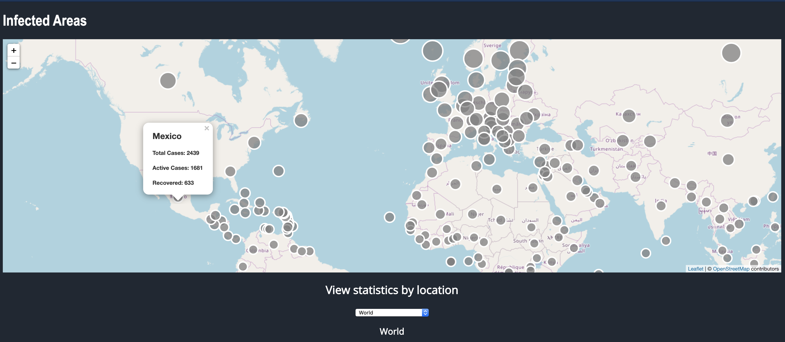
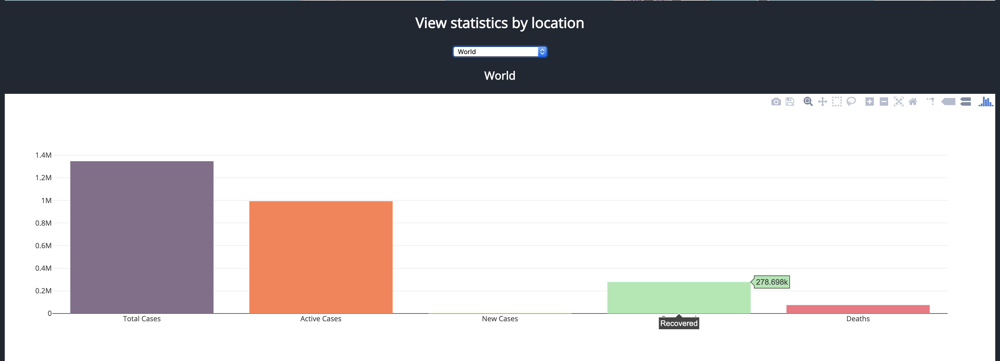
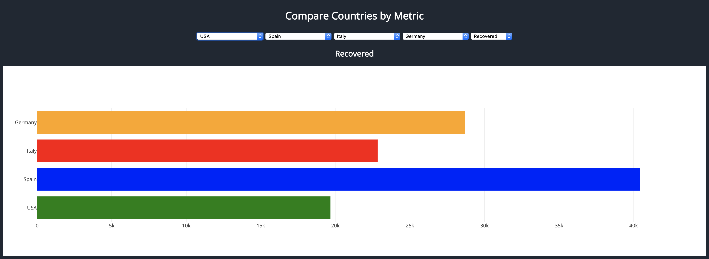

# COVID 19 Data Visualization #
Try it out:
[corona-vizz.herokuapp.com/](http://corona-vizz.herokuapp.com/)

## About ##
This project was designed to visualize the spread of Covid-19.
It runs on Python, MongoDB, and Javascript. Data is scraped from the web and stored in Mongo. The app then matches up countries with the proper coordinates and plots them on an interactive map using leaflet. Dynamic charting 
is available to which allows you to view the statistics of each country and compare up to four at a time.

## Map with popup data ##

## Statistics by location ##

## Compare countries by metric ##

### Web Scraping / API Calls ###
[scraper.py](Scrape/scraper.py)

### Flask App ###
[app.py](Flask/app.py)

### Javascript Plots ###
[plot.js](Flask/static/js/plot.js)